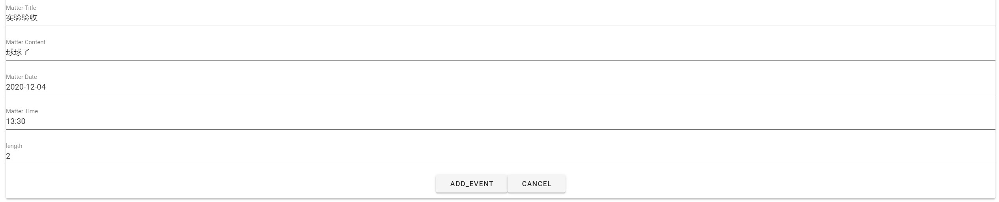

<strong>程序设计文档</strong>

=================

[toc]

## 一、 软件概要设计

### 模块划分

程序分成了两个主要模块，前端模块和后端模块。前端模块使用VueJS编写，只负责界面的渲染和基本的数据检查。后端模块使用python编写，实现数据的转储以及日程的维护，可以同时支持多个客户端使用。
对于服务器端程序，我们详细划分了4个部分：用户登录管理模块、日程数据模块、数据库模块、客户端交互模块。对于客户端程序，我们划分成为了4个部分：前端界面模块、数据查错模块、服务器交互模块、人机交互模块。
模块间主要关系如下：
<!-- gaiyixia -->

各模块主要作用如下：
<strong>服务器端：</strong>
客户端交互模块
用户登录管理模块：设计并实现了用户登录注册等功能。
日程数据模块：建立日程项目并将其存储。
数据库模块：存储并管理日程数据和用户数据。
客户端交互模块：处理客户端的请求，返回对应的策略信息。
<strong>客户端：</strong>
数据查错模块、服务器交互模块、人机交互模块。
前端界面模块：人机交互界面的整体绘制，相关模块绘制。
数据查错模块：针对准备要发向后端的数据进行差错。
服务器交互模块：与服务器通信、发送用户请求，接受服务器处理结果。
人机交互模块：接受用户发出的操作，对用户的请求进行响应。

### 接口设计

服务器和客户端之间使用websocket通信，每次在客户端用户做一次操作，都会向服务器发送一个操作串。其中包括操作模式码以及对应模式的各项参数。回复的操作串中的同样包括操作模式码以及对应模式的各项参数。

### 软件运行流程 

首先保证服务器运行，然后运行客户端即可，详细操作说明见后“操作说明”。

## 二、算法设计

### 事件排列

事件排列部分采取贪心算法对其进行操作。
下面证明采取贪心算法的正确性。
对于剩余事件不足以进行全部的所需时间的事件，我们认为其到截至时间为止。
考虑两个事件，我们认为总工作时间最长的排列方法更优，如果两者工作时间相同，我们认为完成时间更早的排列方法更好。
考虑两个事件$A,B$,其截止时间分别为$A_1,B_1$,其持续时间分别为$A_2,B_2$，假设$A_1<B_1$。分类讨论，如果$A_2 > A_1$,$t_{all} = A_1 + \min(B_2,B_1 - A_1)$, 否则$t_{all} = A_2 + \min(B_2,B_1 - A_2)$。如果$A,B$的顺序颠倒，同样是分类讨论，如果$B_2 > B_1$,$t_{all} = B_1$, 否则$t_{all} = B_2 + \min(A_2,A_1 - B_2)$。
如果$B_2 > B_1$，则$B_1 - A_1 < B_2$，则对第一种情况，有$t_{all} = A_1 + B_1 - A_1 = B_1$与$B_1$相等，对第二种情况，$t_{all} = A_2 + \min(B_2,B_1 - A_2) > B_1$。如果$B_2<B_1$，对第一种请款，$t_{all} = A_1 + \min(B_2,B_1 - A_1) > A_1$，对第二种情况，$t_{all} = B_2 + \min(A_2,A_1 - B_2) > A_1$，综上A排在B前更优，则贪心成立。

### 客户端服务端通信

考虑到可能有多客户端同时通信的情况，所以服务端websocket才用多线程编程，listen通过异步执行，当有客户端创建时，创建一个协程，对协程进行操作，防止多个通信被阻塞的情况。同时在对数据库进行写入或者修改操作时，通过加锁保证同时的查询的正确性。

## 三、前端界面设计

### 整体结构划分

前端部分主要分为几个界面，分别为用户登录界面，程序主界面，事件添加界面，以及事件删除界面。

#### 用户登录界面

主要包括账号输入框，密码输入框，以及登入按钮和注册按钮。
同时包含三种报错，详见下图。

#### 程序主界面

其负责时间表的显示，以及向其他页面的跳转，其具体内容见下图。

#### 事件添加界面

负责处理新添加事件的需求，需要输入事件标题，事件内容，事件持续事件并选择截至时间，精确到秒，具体内容如下图。

#### 事件删除部分

负责处理删除事件的需求，从可见的事件标题列表中点击即可删除，具体内容如下图。

## 四、操作说明

首先是登录界面,

键入用户名和密码后即可点击登录或者注册，如果弹出提醒则按提醒进行修改。
然后会进入程序的主页面。

点击左上按钮会进入删除页面，
点击右侧加号则可进入事件添加界面。
在主界面上侧图片中分别为当前时间，当前日期。
主界面下侧为时间轴，即事件的安排情况。
时间轴第一项为当前时间，下面的项目为安排的项目，
首先为开始时间以及结束时间，
然后是事件标题，然后是事件内容。
在事件插入页中，

从上到下分别为事件标题，事件内容，事件截止日期，事件截止时间，事件预期持续时间。
日期选择通过点击显示菜单选择，如下图。

时间选择通过点击显示菜单选择，如下图。

添加完成后点击ADD_EVENT添加事件。
最后是删除页面，如下图

点击想删除的事件的标题即可删除，点击左上角按钮即可返回主界面。

## 五、历史维护记录
* 确定了日程表项目名称及大致内容
* 构建后端日程排列程序
* 对日程排列进行测试
* 修复了关于截止日期与持续时间终点的大小比较错误问题
* 修复了关于日期函数错误获取时间的问题
* 在服务端搭建了数据库
* 完成了数据库交换程序
* 对数据库交换程序进行测试
* 修复了若干bug
* 构建前后端通信程序
* 构建测试程序对通信测试
* 增加了异步通信的功能使得通信可以多用户同时进行
* 对异步通信进行测试
* 修复了两用户同时对数据库操作所造成的数据冲突bug
* 增加了用户登录注册功能
* 增加了用户登录注册的前端程序
* 修复了用户输入不合法产生的bug
* 增加了用户输入查错
* 增加了日程添加的前端页面
* 修复了日程添加中出现过去时间的bug
* 增加了日程删除的功能
* 增加了程序主界面
* 增加了时间线显示日程的方式
* 增加了同步时间显示
* 修复了已知bug
